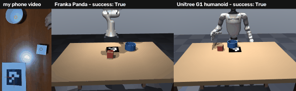
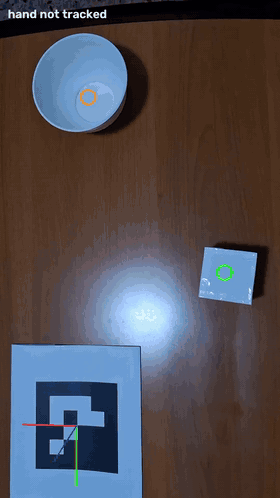
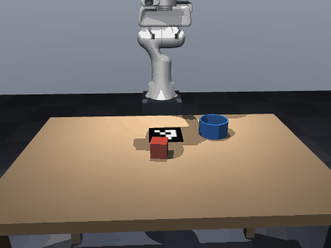
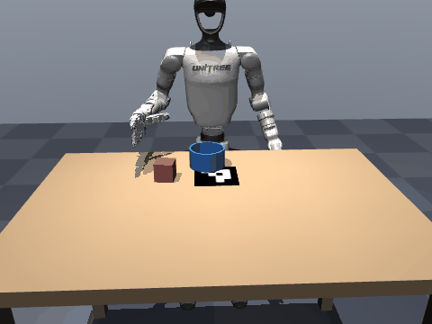
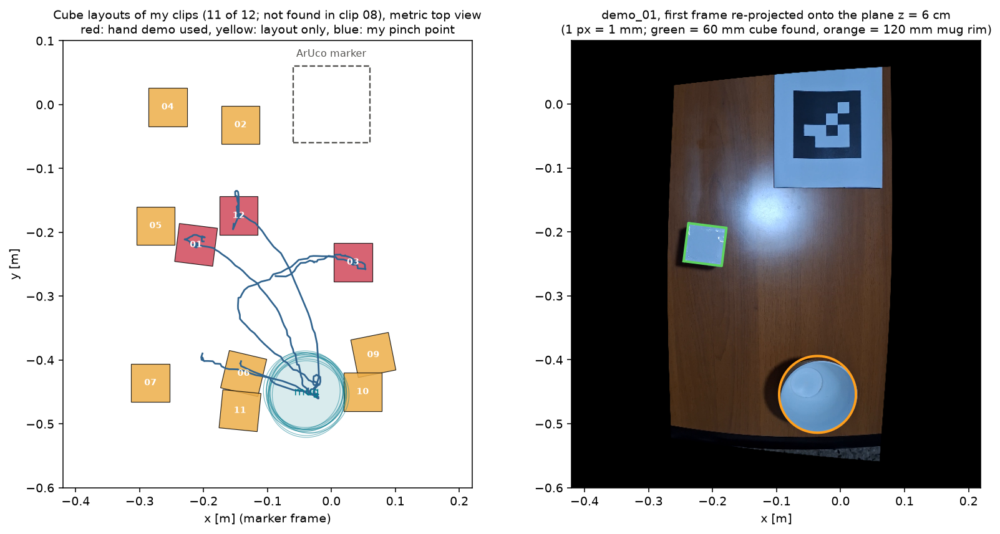
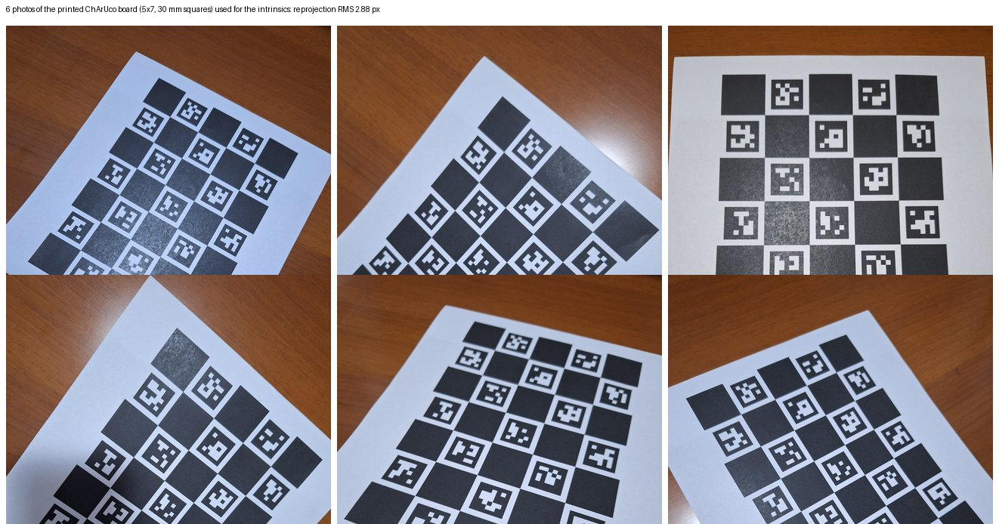
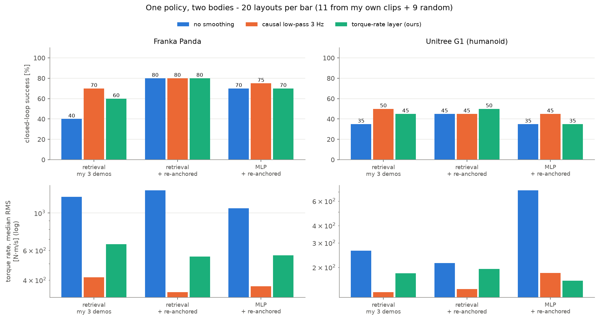
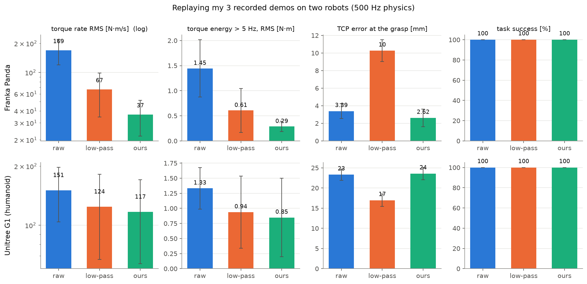
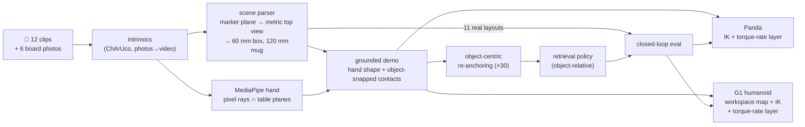

# Watch my hand. Now watch a humanoid do it.

### ego2sim — one phone video, two robot bodies, one policy

I filmed my right hand putting a 6 cm box into a mug, 12 times, with a phone. From those clips alone
this repository rebuilds each scene in metric 3D, replays my motion on a **Franka Panda arm** and on a
**Unitree G1 humanoid** with a three-finger Dex3 hand, checks every replay's joint torques in MuJoCo
physics, and runs **one closed-loop policy** that drives both bodies.

Built for the humanoid challenge of the Robot Learning Research Internship.



*Left: my phone clip with the tracked hand. Middle and right: the same demonstration replayed by the
two robots, simulated at 500 Hz with torque-rate retargeting.*

| | Panda | G1 humanoid |
|---|---|---|
| My demonstrations replayed (3 clips × 3 retargeting methods) | **9/9** put the box in the mug | **9/9** put the box in the mug |
| Torque-rate RMS: raw IK → torque-rate layer | 169 → **37** N·m/s (−78 %) | 151 → **117** N·m/s (−22 %) |
| Closed-loop policy on the 11 layouts I recorded | **9/11** | **5/11** |
| Closed-loop policy on 20 layouts (11 mine + 9 random) | **80 %** | **45–50 %** |

Every number here comes from my recordings (`data/`) and the scripts in `scripts/`. None of it is
synthetic. The failures are reported next to the successes.

---

## See it

<table>
<tr>
<td align="center" width="30%">
<br>
<sub><b>What the phone sees.</b> MediaPipe hand (cyan), the table marker's axes, the mug rim (orange)
and my pinch point (green), tracked frame by frame.</sub>
</td>
<td align="center" width="35%">
<br>
<sub><b>One policy on the Franka Panda</b>, first of my recorded layouts (demo 01). Success.</sub>
</td>
<td align="center" width="35%">
<br>
<sub><b>The same policy on the Unitree G1</b>, same layout, same memory. Success.</sub>
</td>
</tr>
</table>



*Left: the box and mug positions of my clips in metric top view, on the table plane (11 of 12 clips;
the box was not found in clip 08). Red: clips with a clean hand demonstration. Blue: my pinch path.
Right: the first frame of clip 01, re-projected onto the table, with the 60 mm box and the 120 mm mug
rim found by their size.*



*The six photos of a printed ChArUco board used to calibrate the phone camera (reprojection RMS
2.88 px). The intrinsics were then rescaled to the 1080×1920 video.*



*One policy, two bodies. Closed-loop success (top) and median torque rate (bottom) for each policy
and smoothing setting, on 20 layouts per bar. The numbers are in the Results section.*



*My three clean demonstrations replayed on both robots at 500 Hz physics. Error bars: standard
deviation over the three demos.*

---

## What is new here, and what is not

Nothing in this repository is a new learning algorithm. MediaPipe, OpenCV's ChArUco calibration, the
MuJoCo Menagerie robot models, MimicGen-style object re-anchoring and VINN-style retrieval are all
reused. What is new is the chain, and the way each link is checked:

1. **The table is the ruler.** One printed marker defines the table plane. The box and the mug are
   then found by their *metric* size on that plane. No object scans, no depth sensor, and no
   detector trained for this scene.
2. **One human demonstration, two morphologies.** The same motion is retargeted to a fixed-base arm
   with a parallel gripper and to a humanoid with a three-finger dexterous hand.
3. **Physics, not only kinematics.** Every replay runs at 500 Hz in MuJoCo with joint torques
   logged. A success means the box really ends up in the mug.
4. **A torque-rate objective for retargeting.** The retargeter penalises the rate of change of the
   joint torques, d/dt(M(q)·q̈), using each robot's own mass matrix, instead of only smoothing the
   joint angles. Online, it did not beat a simple causal filter (see *What worked and what didn't*).
5. **One object-relative policy for both bodies.** Observations and actions are measured relative to
   the box and the mug. The policy is trained only on my three demonstrations and their re-anchored
   copies, and the same retrieval memory drives both robots.

How this compares with the closest work I read (I summarised each from its abstract and method
section; the table is my reading, not the authors' claims):

| | Input | Physics checked? | Embodiments | Hand | What the policy sees |
|---|---|---|---|---|---|
| [Real2Render2Real](https://arxiv.org/abs/2505.09601) | one human video, plus a multi-view phone scan of every object | No: objects are kinematic, no contact dynamics | ABB YuMi (parallel jaws); Franka in the appendix | parallel jaws only | rendered RGB (Diffusion Policy, π0-FAST) |
| [DemoGen](https://arxiv.org/abs/2502.16932) | one human demonstration | Not stated in the abstract | real-world platforms, incl. dexterous hands and bimanual | dexterous hands in real tasks | synthesised point clouds, visuomotor |
| [VideoMimic](https://arxiv.org/abs/2505.03729) | ~123 casual smartphone videos | Yes: RL in IsaacGym | Unitree G1, locomotion | none | proprioception + height map, RL-distilled |
| **ego2sim (this repo)** | 12 phone clips, 6 board photos, one printed marker; 3 clean demos used for the policy | Yes: MuJoCo at 500 Hz, torques logged | Franka Panda and Unitree G1 | Dex3 three-finger hand on the G1 | object-relative state: retrieval memory and MLP, closed loop on both bodies |

**Where it differs, and why that matters**

* **Versus Real2Render2Real.** It scans every object and renders visual training data, without
  simulating contact. I scan nothing: the scene comes from the marker and the measured object sizes.
  In exchange I simulate contact and torques, which is what makes the G1's grasp error and the torque
  cost of each method measurable. Its visual data is what my pipeline lacks.
* **Versus DemoGen.** It generates new *observations* from one demonstration, so that a visuomotor
  policy can be trained on them. I generate new *trajectories*, re-anchored to the object, and check
  each one by replaying it on the robot. My policy is state-based, which is its largest limitation.
* **Versus VideoMimic.** It learns whole-body humanoid skills (stairs, sitting, standing) from many
  casual videos, with RL in simulation. It has no hands. This repository covers one manipulation task
  with a dexterous hand, from three clean demonstrations, with no RL in the loop. It is far smaller in
  scope, and it covers the part that VideoMimic leaves out.
* **Versus MimicGen.** The re-anchoring step follows MimicGen. Here the source segments come from a
  phone video with measured geometry, and the result is tested on two different bodies.

In short: the parts are standard. The contribution is that a single phone video, one printed marker
and twelve clips are enough to produce demonstrations that are measured in metres, replayed with
physics, and driven by one policy on two bodies, with the failures reported.

---

## How it works



| Stage | What it does | The idea that makes it work |
|---|---|---|
| **1. Scene** | first frame → box pose and mug pose, in mm | *The table is the ruler.* The marker gives the table plane, so a frame can be re-projected onto the box-top plane (6 cm) and the mug-rim plane (6.5 cm) at 2 mm per pixel. A 60 mm square and a 120 mm circle are then found by their metric size. A first-frame / last-frame difference isolates the box, the only thing that moves. |
| **2. Demo** | hand track → robot-agnostic demonstration | *Trust what a single camera measures well.* MediaPipe gives good 2D keypoints and poor depth. The pinch point is the intersection of its pixel ray with a horizontal plane at a task-structured height (grasp at box half-height, carry over the rim, release above the mug). The two contacts are snapped to the box and mug from stage 1, and the shape and timing of my motion are kept in between. |
| **3. Retargeting** | demo → joint trajectories on two robots | *A torque-rate layer.* A QP finds the closest trajectory with a low `d/dt(M(q)·q̈)`, weighted by each robot's own mass matrix and pinned tightly around grasp and release. On top of it, contact retiming: a servo gripper needs about 0.5 s to close where my fingers need about 0.1 s. |
| **4. Policy** | 3 demos → one closed-loop policy for both bodies | *Object-relative retrieval.* Observations are box−gripper and mug−gripper offsets. Actions are waypoints relative to the box (before the grasp) or the mug (after it). The policy is a nearest-neighbour lookup into my re-anchored demos, so every action it outputs is a blend of real human motion. |

---

## Results

### 1. Perception: what the phone measures

* **Calibration:** 6 board photos, reprojection RMS **2.88 px**. This is checked by the next point.
* **Scene parser:** across the 12 clips it measured the mug at **118–125 mm** (true 120 mm) in 11 clips,
  and the box at **57–66 mm** (true 60 mm) in 11 clips. It missed the mug once (clip 10; the fallback
  is the median mug position, since the mug never moved) and the box once (clip 08).
* **Hand:** MediaPipe found my hand in **0–55 %** of frames. In most clips the hand enters from the image
  edge and only part of it is ever in view. **3 clips** (01, 03, 12) have a clean track through both
  grasp and release. Those are the demonstrations. The other clips with a detected box still contribute
  their **layouts**: the bounds for augmentation and the test scenes.
* **The hand track and the scene parser are independent measurements.** Compared with each other, my
  pinch point was **12–42 mm** from the box centre at lift-off and **5.5–13 mm** from the mug centre at
  release. That is roughly the accuracy of the hand track, and the reason the contacts are snapped to the
  objects.

Per-clip table: [`outputs/perception/qa.md`](outputs/perception/qa.md). Overlays for every clip:
`outputs/perception/demo_XX.mp4`.

### 2. Retargeting: replaying my 3 demos on both robots

Each demo is replayed in MuJoCo at 500 Hz with joint torques logged, using three methods: raw
per-frame IK, a zero-phase Butterworth low-pass at 2.5 Hz, and the torque-rate layer (λ = 1e-5 on the
Panda, 1e-3 on the G1).

| robot | method | success | torque-rate RMS [N·m/s] | torque > 5 Hz [N·m] | TCP error at grasp [mm] |
|---|---|---|---|---|---|
| Panda | raw IK | 3/3 | 169.4 | 1.45 | 3.4 |
| Panda | low-pass 2.5 Hz | 3/3 | 66.6 | 0.61 | 10.3 |
| Panda | **torque-rate layer** | 3/3 | **36.6** | **0.29** | **2.6** |
| G1 | raw IK | 3/3 | 150.7 | 1.33 | 23.3 |
| G1 | low-pass 2.5 Hz | 3/3 | 124.2 | 0.94 | **17.0** |
| G1 | **torque-rate layer** | 3/3 | **117.0** | **0.85** | 23.6 |


* **Panda:** the layer gives the low-pass filter's smoothness *and* raw IK's precision. It has 45 % less
  torque rate than the low-pass, and the grasp error stays at 2.6 mm where the low-pass blurs it to
  10 mm. The sweep below shows that no low-pass cut-off reaches this point.
* **G1: here my layer loses.** It beats raw IK by 22 %, but it is only about 6 % smoother than the 2.5 Hz
  low-pass. The sweep shows that a 1 Hz low-pass is smoother in torque rate (115 vs. ≥117 N·m/s for every
  λ tested) and much more precise at the grasp (15 mm vs. 23 mm). The ~23 mm grasp error is already in
  raw IK. It comes from squeezing my workspace into the shorter G1 arm. The layer keeps it, because it
  tracks the raw targets tightly at the contacts; heavy low-pass rounds the approach and happens to
  cancel part of that offset.
* `outputs/retarget/metrics.csv` has every row, including the λ and cut-off sweep.

### 3. One policy, two bodies

Test scenes: the **11 box/mug layouts from my own clips**, plus 9 random layouts in the same region.
The same layouts are used for every variant and both robots. The policy is a retrieval memory (VINN-style)
or an MLP chunk policy, trained on my 3 demonstrations, with or without 90 re-anchored copies. Each is run
with three ways of smoothing its joint commands online: none, a causal 3 Hz low-pass, or the torque-rate
layer.

| Policy and memory | Smoothing | Panda success | G1 success |
|---|---|---|---|
| retrieval, my 3 demos | none | 40 % | 35 % |
| retrieval, my 3 demos | causal low-pass 3 Hz | 70 % | 50 % |
| retrieval, my 3 demos | torque-rate layer | 60 % | 45 % |
| **retrieval, + re-anchored copies** | none | **80 %** | 45 % |
| **retrieval, + re-anchored copies** | causal low-pass 3 Hz | **80 %** | 45 % |
| **retrieval, + re-anchored copies** | torque-rate layer | **80 %** | **50 %** |
| MLP, + re-anchored copies | none | 70 % | 35 % |
| MLP, + re-anchored copies | causal low-pass 3 Hz | 75 % | 45 % |
| MLP, + re-anchored copies | torque-rate layer | 70 % | 35 % |

Full table with torque rates: [`outputs/policy/summary.md`](outputs/policy/summary.md). Per-episode
results: `outputs/policy/eval_panda.csv` and `eval_g1.csv`.

* **Re-anchoring helps the Panda.** With my 3 demos alone, retrieval reaches 40–70 %. With the re-anchored
  copies it reaches 80 % whatever the smoothing, so the policy no longer depends on how its commands are
  filtered. On the G1 the copies make no clear difference: with filtered or torque-rate commands, both
  versions land at 45–50 %, which is within the noise of a 20-episode test.
* **Smoothing matters without re-anchoring.** On the Panda, unsmoothed retrieval on my 3 demos commands
  torques that hit the 87 N·m limit, and success falls from 70 % to 40 %.
* **The same policy runs on the humanoid**, unchanged, at about half the Panda's success rate. The G1
  closes its hand on the box in 95 % of episodes, but gets it into the mug in only 45–50 %. I have not yet
  sorted those failures into slips during the carry and misses at the mug.

With 20 layouts a single episode is 5 percentage points, so differences of 5–10 points between variants are
within noise. The rollout GIFs above show the first two test layouts, both successful on both robots; they
were not selected for success.

---

## What worked and what didn't

The honest part: the project I planned is not quite the project that worked.

**Didn't work: metric hand depth from one camera.** The plan was MediaPipe's 3D hand estimate with PnP for
absolute depth, with the hand size calibrated from a flat palm resting on the table. On the real clips the
hand height at the grasp came out **23 to 208 mm** wrong (it should be about half the box height). The
calibration rest never ran: in no clip is the full hand visible at the start.
→ I replaced depth from the hand with **depth from the table**: pixel rays intersected with known planes, and
a separate, hand-free scene parser for the objects. That turned out to be the most robust part of the pipeline.

**Didn't work: 9 of my 12 clips as demonstrations.** The hand is half out of frame, so MediaPipe loses it.
Instead of re-recording, those clips became **layouts**: the scene parser still reads where the box was. They
define where the augmentation samples, and they are the test set. *Lesson for the next recording: keep the
whole hand in frame.*

**Worked: snapping contacts to the objects.** The hand track is only about 1–4 cm accurate, and a 60 mm box and
a 120 mm mug are not forgiving. In my first replays the Panda's grasp in demo 01 did not lift the box, which was
dragged along the table instead. The fix shifts the trajectory smoothly so that the grasp lands on the box and
the release on the mug, while keeping my motion in between.

**Worked: contact retiming.** Replaying my timing exactly, the Panda lifted before its fingers had closed and
left the box behind. A 0.5 s dwell at the grasp and 0.4 s at the release fixed every replay.

**Didn't work at first: an MLP on 3 demos with absolute positions and a wall clock.** It fit my three demos
almost perfectly (about 1 mm action error on its own training data) and failed on new layouts: after the grasp it
drifted away from the mug, or never let go. What fixed it, step by step:
1. **object-relative observations** (no absolute positions);
2. **object-anchored actions** (waypoints relative to the box or the mug, so errors don't accumulate);
3. an **event clock** (time since the grasp) instead of a wall clock. Without any clock it held the box forever;
4. the gripper may only open **above the mug** (a skill precondition; it used to drop the box halfway);
5. **commanded proprioception**: the policy sees where it *told* the gripper to go, not where the gripper is.
   Without this the G1, whose fingers stop about 2 cm above the box, never "arrived" and never closed its hand.
   With it, the G1 grasps every time;
6. a **clearance-aware grasp axis**: of the box's two grasp axes, close the fingers across the box→mug direction,
   so no finger has to fit into the gap between the box and the mug;
7. **wait for the hand to open** before lifting: the Dex3 fingers open slowly and used to flick the box back out.

After all that, the MLP works (70–75 % on the Panda). A **nearest-neighbour retrieval policy** over the same
object-relative states is as good or better, has nothing to overfit, and every action it outputs is a blend of
real human motion. With 3 demonstrations, that is the honest choice.

**Didn't work: my torque-rate layer online.** Offline, on whole trajectories, it beats the low-pass on the Panda
and only narrowly on the G1 (table above). Online, on 0.5 s policy chunks, the plain causal low-pass gave equal or
better success and lower torque rate on both robots. I tuned the online λ for success, and it ended up too small to
smooth much. Pinning the first samples of every chunk also keeps the replanning seams. The fair conclusion: the
layer pays off when it sees the whole trajectory.

**Didn't work: a tighter G1 workspace map.** I fitted the human→G1 map to the G1's measured reach. Replay success
dropped from 3/3 to 1/3, because the arm needs slack at the edge of its reach. I reverted it.

**Didn't work: the sim camera at my phone's pose.** It renders the scene from exactly where my phone was, but the
phone was inside the space the robot occupies, so the arm fills the frame. The video uses a fixed side camera
instead. `side_by_side.py --cam phone` still produces the other view.

---

## Run it

```bash
git clone https://github.com/Degas01/humanoid-challenge && cd humanoid-challenge
python -m venv .venv && source .venv/bin/activate          # tested with Python 3.11 (MediaPipe 0.10.14)
pip install -r requirements.txt
python scripts/fetch_assets.py                             # robot models from MuJoCo Menagerie
export MUJOCO_GL=egl                                       # or osmesa on a CPU-only box
```

The processed data is committed: calibration, per-clip hand tracks, scene layouts and the 3 demos. Steps 2–5
therefore run **without the raw videos**:

| Step | Command | Time (2 CPU cores) |
|---|---|---|
| 1. perception (needs `data/raw/demo_XX.mp4`) | `python scripts/perceive.py && python scripts/perception_figs.py` | ~5 min |
| 2. retargeting and sweep | `python scripts/retarget_eval.py --sweep --render 1` | ~10 min |
| 3. policies | `python scripts/train_policy.py` | ~5 min |
| 4. closed-loop eval | `python scripts/eval_policy.py --robots panda` and `--robots g1` | ~20 min each |
| 5. figures | `python scripts/figures.py` | seconds |
| headline video | `python scripts/side_by_side.py demo_01` | ~3 min |

`./run_all.sh` runs everything in order. Tests: `python tests/test_geometry.py` and
`python tests/test_pipeline_synthetic.py`. The synthetic generator exists only for these installation tests;
none of its output appears above.

The raw videos (240 MB) are not in the repo. `data/clip_names.txt` maps the clip names to the phone's
file names.

## Repository layout

```
ego2sim/
  perception.py   ArUco table pose, MediaPipe tracking, ChArUco calibration (photos or video)
  scene_parse.py  metric plane rectification -> 60 mm box / 120 mm mug from the first frame
  demo.py         grounded demonstrations: pixel rays ∩ table planes, object-snapped contacts
  frames.py       marker frame of the recordings -> task frame of the simulation
  scene.py        MuJoCo scenes; Panda and G1 embodiments (grasp frames, workspace maps)
  kinematics.py   damped-least-squares IK with null-space posture
  torque_rate.py  TorqueRateLayer (differentiable, PyTorch) + sparse whole-trajectory solver
  retarget.py     raw / low-pass / torque-rate retargeting, contact retiming, table clearance
  execute.py      500 Hz execution with torque logging
  augment.py      object-centric re-anchoring (MimicGen-style)
  policy.py       object-relative observations/actions, retrieval policy, MLP chunk policy
  deploy.py       closed-loop deployment on any embodiment (none / causal low-pass / torque-rate)
scripts/          perceive, perception_figs, retarget_eval, train_policy, eval_policy, figures, side_by_side
data/             measurements, calibration photos + calib.json, tracks, layouts.json, demos
outputs/          everything the scripts produce (figures, tables, videos, GIFs)
```

## Limitations and next steps

* **Three demonstrations.** Everything downstream is limited by how few clean hand tracks there are.
  Re-recording with the hand fully in frame is the cheapest improvement available.
* **State-based policy.** The box and mug positions come from the simulator at test time, not from images.
  The natural next step is to render re-anchored demos from the calibrated phone camera, and to fine-tune a
  vision-language-action model on them, keeping the scene parser as a privileged teacher.
* **Height is structured, not measured.** The pinch height between the contacts follows a task template
  (lift, arc over the rim), not my hand. A second phone, or a depth camera, would make it a measurement.
* **G1 grasp.** The Dex3 lateral grasp is the weakest link (45–50 % end to end). A learned or
  optimisation-based grasp pose would likely help more than any change to the policy.
* **Simulated actuators.** MuJoCo position servos are not real motors. The torque metrics compare methods with
  each other; they do not predict hardware wear.

## Acknowledgements

Robot models: [MuJoCo Menagerie](https://github.com/google-deepmind/mujoco_menagerie) (Franka Emika Panda,
Unitree G1). Hand tracking: [MediaPipe Hands](https://github.com/google-ai-edge/mediapipe). Re-anchoring follows
MimicGen (Mandlekar et al., 2023). The retrieval policy follows VINN (Pari et al., 2021). The related work
compared above: Real2Render2Real ([arXiv:2505.09601](https://arxiv.org/abs/2505.09601)), DemoGen
([arXiv:2502.16932](https://arxiv.org/abs/2502.16932)), and VideoMimic, "Visual Imitation Enables Contextual
Humanoid Control" ([arXiv:2505.03729](https://arxiv.org/abs/2505.03729)).

*Giacomo Demetrio Masone — MSc Robotics, King's College London.*
