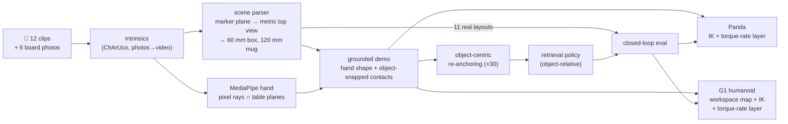
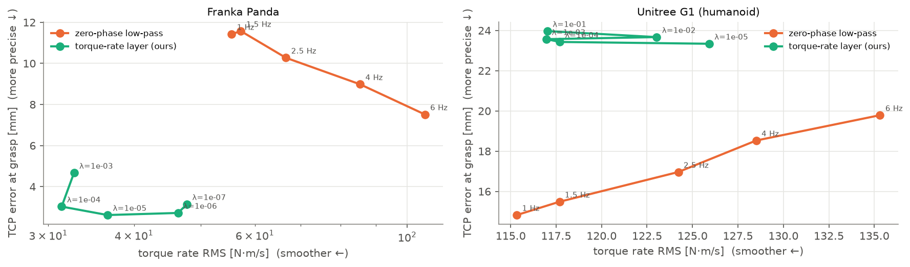

# ego2sim — one phone video, two bodies

**I filmed my own hand putting a 6 cm box into a mug, 12 times, with a phone. From those clips
alone this repo rebuilds each scene in metric 3D, replays my motion on a Franka Panda *and* a
Unitree G1 humanoid (three-finger Dex3 hand) in MuJoCo, and runs one closed-loop policy that
drives both robots.**


*Left: my phone clip with the tracked hand. Middle and right: the same demonstration replayed by
the two robots (500 Hz physics, torque-rate retargeting).*

| | Panda | G1 humanoid |
|---|---|---|
| My demos replayed (3 clips × 3 retargeting methods) | **9/9** in the mug | **9/9** in the mug |
| Torque-rate RMS: raw IK → torque-rate layer | 169 → **37** N·m/s (−78 %) | 151 → **117** N·m/s (−22 %) |
| Closed-loop policy on the 11 layouts I recorded | **9/11** | **5/11** |
| Closed-loop policy on 20 layouts (11 mine + 9 random) | **80 %** | **45–50 %** |

Every number in this README comes from my recordings (`data/`) and the scripts in `scripts/`.
None of it is synthetic. The failures are reported along with the successes.

---

## What I recorded

* **12 clips**, phone held above the table (1080×1920, 30 fps, 7–13 s each). In each one the
  box starts somewhere different and my right hand puts it in the mug.
* **6 photos** of a printed ChArUco board (5×7, 30 mm squares) for the camera intrinsics.
* A printed **ArUco marker** (120 mm, `DICT_4X4_50` id 0) on the table. It defines the table frame.
* Measured sizes: box **60 mm** cube; mug **120 mm** diameter, **65 mm** tall (`data/measurements.json`).

## The pipeline



| Stage | What it does | The idea that makes it work |
|---|---|---|
| **1. Scene** | first frame → box pose + mug pose, in mm | *The table is the ruler.* The marker gives the table plane, so a frame can be re-projected onto the plane z = 6 cm (box top and mug rim height) at 2 mm per pixel. A 60 mm square and a 120 mm circle can then be found by their **metric size**, with no detector to train. A first-frame/last-frame difference isolates the box, since it is the only thing that moves. |
| **2. Demo** | hand track → robot-agnostic demonstration | *Trust what a single camera measures well.* MediaPipe gives good 2D keypoints and bad depth. The pinch point is the intersection of its **pixel ray** with a horizontal plane at a task-structured height (grasp at box half-height, carry over the rim, release above the mug). The two contacts are snapped to the box and mug from stage 1, and the shape and timing of my motion are kept in between. |
| **3. Retargeting** | demo → joint trajectories on 2 robots | *Torque-rate layer.* A QP that finds the closest trajectory with low `d/dt(M(q)·q̈)`, weighted by each robot's own mass matrix and pinned tightly around grasp and release. On top of it: contact retiming, because a servo gripper needs ~0.5 s to close where my fingers need ~0.1 s. |
| **4. Policy** | 3 demos → one closed-loop policy for both bodies | *Object-relative retrieval.* Observations are box−gripper and mug−gripper offsets. Actions are waypoints relative to the box (before the grasp) or the mug (after). The policy is a nearest-neighbour lookup into my re-anchored demos, so every action it outputs is a blend of real human motion. |

---

## Results

### 1. Perception: what the phone actually measures


* **Calibration:** 6 board photos, reprojection RMS **2.88 px**. The intrinsics were scaled from
  the 4:3 photos to the 16:9 video crop. The best check that this worked is the next point.
* **Scene parser (validates the calibration):** across the 12 clips it measured the mug at
  **118–125 mm** (true 120 mm) in 11 clips and the box at **57–66 mm** (true 60 mm) in 11 clips. It
  missed the mug once (clip 10; the fallback is the median mug position, since the mug
  never moved) and the box once (clip 08).
* **Hand:** MediaPipe found my hand in **0–55 %** of frames. In most clips the hand enters from
  the image edge, and only part of it is ever in view. **3 clips** (01, 03, 12) have a clean track
  through both grasp and release. Those are the demonstrations. The other 8 clips with a detected
  box still contribute their **layouts**: for augmentation bounds and as test scenes.
* **Agreement between two independent measurements** (hand track vs. scene parser): my pinch
  point was **12–42 mm** from the box centre at lift-off and **5.5–13 mm** from the mug centre at
  release. That is the accuracy of the hand track, and the reason contacts are snapped to the
  objects.

Per-clip table: [`outputs/perception/qa.md`](outputs/perception/qa.md). Overlays:
`outputs/perception/demo_XX.mp4`.

### 2. Retargeting: replaying my 3 demos on both robots

Each demo is replayed in MuJoCo at 500 Hz with the joint torques logged, using three methods:
raw per-frame IK, a zero-phase Butterworth low-pass at 2.5 Hz, and the torque-rate layer
(λ = 1e-5 Panda, 1e-3 G1).

| robot | method | success | torque-rate RMS [N·m/s] | torque > 5 Hz [N·m] | TCP error at grasp [mm] |
|---|---|---|---|---|---|
| Panda | raw IK | 3/3 | 169.4 | 1.45 | 3.4 |
| Panda | low-pass 2.5 Hz | 3/3 | 66.6 | 0.61 | 10.3 |
| Panda | **torque-rate layer** | 3/3 | **36.6** | **0.29** | **2.6** |
| G1 | raw IK | 3/3 | 150.7 | 1.33 | 23.3 |
| G1 | low-pass 2.5 Hz | 3/3 | 124.2 | 0.94 | **17.0** |
| G1 | **torque-rate layer** | 3/3 | **117.0** | **0.85** | 23.6 |




* **Panda:** the layer gives the low-pass filter's smoothness *and* raw IK's precision. It has 45 %
  less torque rate than the low-pass, and the grasp error stays at 2.6 mm while the low-pass blurs
  it to 10 mm. The sweep shows that no low-pass cut-off reaches this point.
* **G1: my layer loses.** It beats raw IK by 22 % but is only ~6 % smoother than the 2.5 Hz
  low-pass. The sweep shows the **1 Hz low-pass dominating every λ**: smoother *and* more precise
  (15 mm vs. 23 mm). The ~23 mm grasp error is already in raw IK; it comes from squeezing my
  workspace into the shorter G1 arm, and the layer keeps it because it tracks the raw targets
  tightly at the contacts. Heavy low-pass rounds the approach and happens to cancel part of that
  offset.
* `outputs/retarget/metrics.csv` has every row, including the λ / cut-off sweep.

### 3. One policy, two bodies

Test scenes: the **11 box/mug layouts from my own clips** plus 9 random layouts in the same
region. The same layouts are used for every variant, on both robots. Three policies are compared:
retrieval on my 3 demos only, retrieval on demos + 90 re-anchored copies, and an MLP chunk
policy trained on the same augmented data. Each is run with three ways of smoothing its joint
commands online.


| | Panda success | G1 success | Panda torque rate (median) |
|---|---|---|---|
| retrieval, my 3 demos, no smoothing | 40 % | 35 % | 1246 |
| retrieval, my 3 demos, causal low-pass | 70 % | 50 % | 416 |
| **retrieval + re-anchoring, causal low-pass** | **80 %** (9/11 on my layouts) | 45 % | **339** |
| retrieval + re-anchoring, torque-rate layer | 80 % | **50 %** | 552 |
| MLP + re-anchoring, causal low-pass | 75 % | 45 % | 368 |

Full table: [`outputs/policy/summary.md`](outputs/policy/summary.md). Example rollouts:
`outputs/policy/rollout_*.gif`.

* **Re-anchoring helps:** retrieval on the raw 3 demos reaches 40–70 % on the Panda; adding the
  re-anchored copies brings it to 80 % with any smoother.
* **The same policy runs on the humanoid**, with no change and no G1 data, but at about half the
  Panda's success rate. The G1 closes its hand on the box in 95 % of episodes but gets it into
  the mug in only 45–50 %. I have not yet sorted those failures into slips during the carry and
  misses at the mug.
* **Smoothing matters more than the policy class:** with no smoothing, the Panda's torque
  saturates at its 87 N·m limit, and success drops by up to 30 points.

With 20 layouts, a single episode is 5 percentage points, so differences of 5–10 points between
variants are within noise.

---

## What worked and what didn't

The honest part: the project I planned is not the project that worked.

**Didn't work: metric hand depth from one camera.** The plan was MediaPipe's metric 3D hand +
PnP for absolute depth, with my hand size calibrated from a flat-palm rest on the table. On the
real clips the hand height at the grasp came out **23 to 208 mm** wrong (it should be the box's
half-height). The rest calibration never ran: in no clip is the full hand visible at the start.
→ I replaced depth from the hand with **depth from the table**: pixel rays intersected with
known planes, and a separate hand-free scene parser for the objects. That turned out to be the
most robust part of the pipeline.

**Didn't work: 9 of my 12 clips as demonstrations.** The hand is half out of frame (the phone
was too close), so MediaPipe loses it. Instead of re-recording, those clips became **layouts**:
the scene parser still reads where the box was. They define where the augmentation samples, and
they are the test set. *Lesson for the next recording: keep the whole hand in frame, phone ~1 m
up.*

**Worked: snapping contacts to objects.** The hand track is only ~1–4 cm accurate, and a 60 mm box
and a 120 mm mug are not forgiving. In my first replays, before this step, the Panda closed beside
the box in all 3 trials. The fix shifts the trajectory smoothly so that the grasp lands on the
box and the release on the mug, while keeping my motion in between.

**Worked: contact retiming.** Replaying my timing exactly, the Panda lifted before its fingers
had closed and left the box behind. A 0.5 s dwell at the grasp and 0.4 s at the release fixed
every replay.

**Didn't work: an MLP on 3 demos with absolute positions and a wall clock.** It fit my three demos
almost perfectly (about 1 mm action error on its own training data) and failed on new layouts: after the
grasp it drifted away from the mug, or never let go. What fixed it, step by step:
1. **object-relative observations** (no absolute positions);
2. **object-anchored actions** (waypoints relative to the box or the mug, so errors don't
   accumulate);
3. an **event clock** (time since the grasp) instead of a wall clock. Without any clock it held
   the box forever after grasping;
4. the gripper may only open **above the mug** (a skill precondition; it used to drop the box
   halfway);
5. **commanded proprioception**: the policy sees where it *told* the gripper to go, not where the
   gripper is. Without this the G1, whose fingers stop ~2 cm above the box, never "arrived" and
   never closed its hand. Its 2/11 "successes" on my layouts were boxes pushed into the mug.
   With commanded proprioception it grasps every time, and delivers 5/11;
6. a **clearance-aware grasp axis**: of the box's two grasp axes, close the fingers across the
   box→mug direction, so no finger has to fit into the gap between them;
7. **wait for the hand to open** before lifting: the Dex3 fingers open slowly and used to flick
   the box back out of the mug.

After all that, the MLP works (70–75 % on the Panda). A **nearest-neighbour retrieval policy**
over the same object-relative states is as good or better, has nothing to overfit, and every
action it outputs is a blend of real human motion. With 3 demonstrations that is the honest
choice.

**Didn't work: my torque-rate layer online.** Offline, on whole trajectories, it beats the
low-pass (table above). Online, on 0.5 s policy chunks, the plain causal low-pass gave equal or
better success and **lower** torque rate on both robots. I tuned the online λ for success, and it
ended up too small to smooth much. Pinning the first three samples of every chunk also keeps the
replanning seams. The fair conclusion: the layer pays off when it sees the whole trajectory.

**Didn't work: a tighter G1 workspace map.** I fitted the human→G1 map to the G1's measured reach.
Replay success dropped from 3/3 to 1/3, because the arm needs slack at the edge of its reach. I
reverted it.

**Didn't work: the sim camera at my phone's pose.** It renders the scene from exactly where my phone
was, but the phone was inside the space the robot occupies, so the arm fills the frame. The video
uses a fixed side camera instead. `side_by_side.py --cam phone` still produces the other view.

---

## Run it

```bash
git clone https://github.com/Degas01/humanoid-challenge && cd humanoid-challenge
python -m venv .venv && source .venv/bin/activate          # tested with Python 3.11 (MediaPipe 0.10.14)
pip install -r requirements.txt
python scripts/fetch_assets.py                             # robot models from MuJoCo Menagerie
export MUJOCO_GL=egl                                       # or osmesa on a CPU-only box
```

The processed data is committed: calibration, per-clip hand tracks, scene layouts and the 3
demos. Steps 2–5 therefore run **without the raw videos**:

| Step | Command | Time (2 CPU cores) |
|---|---|---|
| 1. perception (needs `data/raw/demo_XX.mp4`) | `python scripts/perceive.py && python scripts/perception_figs.py` | ~5 min |
| 2. retargeting + sweep | `python scripts/retarget_eval.py --sweep --render 1` | ~10 min |
| 3. policies | `python scripts/train_policy.py` | ~5 min |
| 4. closed-loop eval | `python scripts/eval_policy.py --robots panda` and `--robots g1` | ~20 min each |
| 5. figures | `python scripts/figures.py` | seconds |
| headline video | `python scripts/side_by_side.py demo_01` | ~3 min |

`./run_all.sh` runs everything in order. Tests: `python tests/test_geometry.py`,
`python tests/test_pipeline_synthetic.py`. The synthetic generator exists only for these
installation tests; none of its output appears above.

The raw videos (240 MB) are not in the repo. `data/raw/ORIGINAL_NAMES.txt` maps the clip names
to the phone's file names.

## Repository layout

```
ego2sim/
  perception.py   ArUco table pose, MediaPipe tracking, ChArUco calibration (photos or video)
  scene_parse.py  metric plane rectification -> 60 mm box / 120 mm mug from the first frame
  demo.py         grounded demonstrations: pixel rays ∩ table planes, object-snapped contacts
  frames.py       marker frame of the recordings -> task frame of the simulation
  scene.py        MuJoCo scenes; Panda and G1 embodiments (grasp frames, workspace maps)
  kinematics.py   damped-least-squares IK with null-space posture
  torque_rate.py  TorqueRateLayer (differentiable, PyTorch) + sparse whole-trajectory solver
  retarget.py     raw / low-pass / torque-rate retargeting, contact retiming, table clearance
  execute.py      500 Hz execution with torque logging
  augment.py      object-centric re-anchoring (MimicGen-style)
  policy.py       object-relative observations/actions, retrieval policy, MLP chunk policy
  deploy.py       closed-loop deployment on any embodiment (none / causal low-pass / torque-rate)
scripts/          perceive, perception_figs, retarget_eval, train_policy, eval_policy, figures, side_by_side
data/             measurements, calibration photos + calib.json, tracks, layouts.json, demos
outputs/          everything the scripts produce (figures, tables, videos, GIFs)
```

## Limitations and next steps

* **Three demonstrations.** Everything downstream is limited by how few clean hand tracks
  there are. Re-recording with the hand fully in frame is the cheapest improvement available.
* **State-based policy.** The box and mug positions come from the simulator at test time, not
  from images. The natural next step is to render re-anchored demos from the calibrated phone
  camera and fine-tune a VLA (e.g. SmolVLA) on them, keeping the scene parser as a privileged
  teacher.
* **Height is structured, not measured.** The pinch height between the contacts follows a task
  template (lift, arc over the rim), not my hand. A second phone, or a depth phone, would make
  it a measurement.
* **G1 grasp.** The Dex3 lateral grasp is the weakest link (45–50 %). A learned or
  optimisation-based grasp pose would likely help more than any policy change.
* MuJoCo position servos are not real motors. The torque metrics compare methods with each other;
  they do not predict hardware wear.

## Acknowledgements

Robot models: [MuJoCo Menagerie](https://github.com/google-deepmind/mujoco_menagerie) (Franka
Emika Panda, Unitree G1). Hand tracking: [MediaPipe Hands](https://github.com/google-ai-edge/mediapipe).
Re-anchoring follows MimicGen (Mandlekar et al., 2023). The retrieval policy follows VINN
(Pari et al., 2021).

*Giacomo Demetrio Masone — MSc Robotics, King's College London.*
